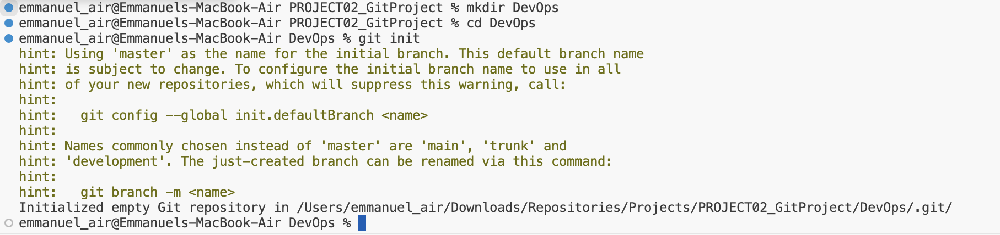

# Dev Ops Training Projects - Darey.io 

## GIT Practice Project - Emmanuel
> _**Git**_ Commands helps to collaborate on projects amongst technical teams

> _**Git**_ is a widely used and powerful version control system in software development. This practical project is done to show my knowledge of its core concepts through hands-on exercises.

### Initializing a Repository and Making Commits
The below steps were followed:
I launched a terminal on my computer and utilized the git command-line interface for this project. Following that, I made a directory named _DevOps_ using the command `mkdir DevOps`, and then navigated to the newly created directory using `cd DevOps`. While inside the _DevOps_ directory, I proceeded to initialize the folder as a Git repository by executing the `git init` command.

  
Once initialized, I proceeded to create a new text file in my working directory named _index.txt_ using the command `touch index.txt`. After that, I added a line of text to the file using the command `echo "Excited to be making my first commit" > index.txt`. Following this, I included my changes in the git staging area by executing the command `git add .`, and then committed my changes using the command `git commit -m "initial commit".

### Working with Branches  
- I used the command `git checkout -b dump` to create a new branch named _dump_.
- After that, I used `git branch` to list my branches.
- I also used `git checkout main` to switch branches
- I used `echo` to add an entry into the index.txt file
- I checked the information by using the command `git status`
- I added my changes and commit using the commands `git add .` and `git commit -m "another line added"` respectively.
- After confirming changes made to the text file, I switched back to dump using the command `git checkout dump`.
- Then I did a merge using the command `git merge main`
- I deleted a branch using the command `git branch -d can`

### Collaboration and Remote Repositories
I created an account on [GitHub](https://github.com/) and set up a new repository named [DevOps]. After that, I pushed my local git repository to the newly created remote GitHub repository using the command `git remote add origin `, then set _**main**_ as the main branch using `git branch -M main`, and finally pushed the contents to the remote repository with `git push -u origin main`.

- Now that my repository is on [github](https://github.com/) my colleague _Mark_ wishes to make changes to my text file
- He can achieve this by cloning the remote git repository using the command below
- `git clone https://github.com/itoroekpo/DevOps.git`

- _You can see the result of the clone command below. The remote git repository has been cloned into directory named __Mark__ on the local machine_

