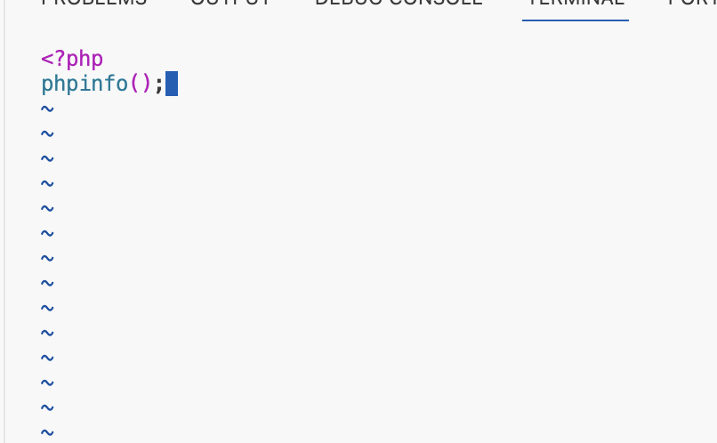

# Dev Ops Training Projects - Darey.io 

## LAMP STACK Project - Emmanuel

**LAMP**, which stands for Linux, Apache, MySQL, and PHP, provides a robust set of tools for web development and deployment. The LAMP Stack project shows my set up of a Linux environment, configuring the Apache web server, managing MySQL databases, and crafting PHP code for server-side functionality.

Step 0 - Creating the Instance

1. I've created a virtual server instance with Ubuntu Server OS using Elastic Compute Cloud (EC2). Screenshot below

2. I've connected to my EC2 instance using ssh with the following command: ssh -i "ProjectLAMP290124.pem" ubuntu@ec2-3-83-30-117.compute-1.amazonaws.com

For my implementation, I'm using the Visual Studio terminal.

Take a look at the screenshot of my connected instance below.

## Let's dive into the world of LAMP Stack and unleash the potential of web application development!

**Step 1** - Installing Apache and Updating the Firewall
The Apache HTTP server stands as a titan in the realm of web server software, boasting a staggering 67% share of all web servers worldwide. Developed and maintained by the esteemed Apache Software Foundation, this open-source software is not only powerful but also freely available. 

Here are the steps I took to install Apache:
1. Kick things off by updating the list of packages in the package manager using the command sudo apt update.

2. Next, let's start the installation of the apache2 package with the command sudo apt install apache2.

3. Ensure that apache2 is up and running by executing the command sudo systemctl status apache2.

4. Let's ensure that TCP port 80 is wide open:
* Test it out with curl http://localhost:80
   
* Also, try curl http://127.0.0.1:80
   

5. Now, let's test the Apache HTTP server’s response to requests from the internet:
* Allowed inbound connection using http in AWS Security groups
   
* The URL will be http://3.83.30.117:80!
   
   

**Step 2** - Installing MySQL
Now that a web server is up and running, I need to install a Database Management System (DBMS) to store and manage data for my site in a Relational Database. I installed MySQL using the steps below:
1. Install MySql using command sudo apt install mysql-server
2. When installation is complete, login to the MySQL console by typing sudo mysql
    
3. Set password for root user to PassWord.1
* ALTER USER 'root'@'localhost' IDENTIFIED WITH mysql_native_password BY 'PassWord.1';
    
4. Exit the MySQL shell with the command exit
5. Start the interactive script by running sudo mysql_secure_installation
    
6. Test login
    

**Step 3** - Installing PHP

Now that I've got Apache set up to serve my content and MySQL installed to handle my data, it's time to bring in the final piece of the puzzle: PHP. PHP will work its magic by processing code to deliver dynamic content to the end user. Along with the php package, I'll need php-mysql, a PHP module that facilitates communication with MySQL-based databases. Additionally, I'll require libapache2-mod-php to empower Apache in handling PHP files. It's all coming together for a seamless and powerful LAMP technology stack!

1. Install all 3 packages at once with the command sudo apt install php libapache2-mod-php php-mysql
    
2. Run php -v to confirm the php version.
    

**Step 4** - Create a Virtual Host for my Website using Apache

A virtual host allows you to have multiple websites located on a single machine and users of the websites will not even notice it.
1. Setup a new domain called projectlamp by creating its directory
_sudo mkdir /var/www/projectlamp_
2. Assign ownership of the directory with the $USER environment variable which will reference my current system user.
_sudo chown -R $USER:$USER /var/www/projectlamp_
3. Create and open a new configuration file in Apache's sites-available directory using your preferred command-line editor.
_sudo vi /etc/apache2/sites-available/projectlamp.conf_
This will create a new blank file. Paste in the following bare-bones configuration by hitting i on the keyboard to enter insert mode, and paste the text below:
4. Save and close the file
5. Enable the new virtual host
_sudo a2ensite projectlamp_
6. Disable Apache's default website if you're not using a custom domain name
_sudo a2dissite 000-default_
7. Confirm your configuration file does not contain syntax errors
_sudo apache2ctl configtest_

8. Finally, reload Apache so these changes take effect
_sudo systemctl reload apache2_

**Step 5** - Enable PHP on the website
With the default Directory Index settings on Apache, a file named index.html will always take precedence over an index.php file. This is useful for setting up maintenance pages in PHP applications by creating a temporary index.html file containing an informative message to visitors. Because this page will take precedence over the index.php page, it will then become the landing page for the application. Once maintenance is over, the index.html is renamed or removed from the document root, bringing back the regular application page.
In case you want to change this behavior, you'll need to do the following:
1. Edit the /etc/apache2/mods-enabled/dir.conf file and change the order in which the index.php file is listed within the DirectoryIndex directive:
sudo vim /etc/apache2/mods-enabled/dir.conf
2. After saving and closing the file, reload Apache so the changes take effect:
sudo systemctl reload apache2
3. Finally, create a PHP script to test that PHP is correctly installed and configured on your server
	•	Create a new filed named index.php inside the custom web roor folder
_vim /var/www/projectlamp/index.php_
	•	This will open a blank file. Add the following text, which is valid PHP code, inside the file:

	•	Save and close the file. Refresh the page and you will see a PHP information landing page like the one below:
    

