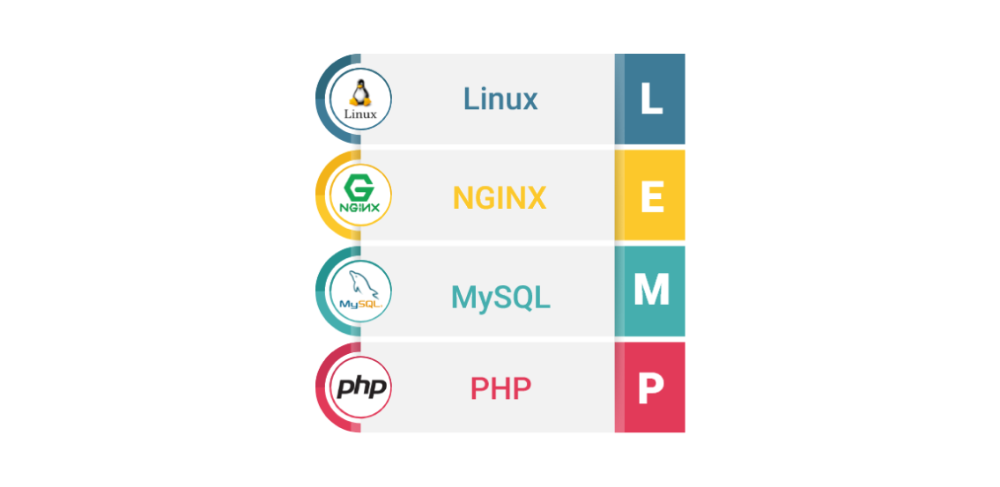

# Dev Ops Training Projects - Darey.io 

# LEMP STACK IMPLEMENTATION

## Introduction to LEMP Stack

In the previous project, we explored the LAMP Stack, and now it's time to delve into the LEMP Stack. Understanding this stack is crucial for web development, as it comprises Linux, Nginx, MySQL, and PHP, offering a powerful combination for hosting web applications.

### What is LEMP Stack?

The LEMP Stack is a collection of open-source software that works seamlessly together to host web applications. Unlike the LAMP Stack, which uses Apache, the LEMP Stack utilizes Nginx as its web server. This difference brings its own set of advantages, particularly in terms of performance and scalability.

### Advantages of LEMP Stack

1. **Performance**: Nginx, the core of the LEMP Stack, is renowned for its high performance and ability to handle multiple connections simultaneously. This is crucial for applications that need to support heavy traffic.
  
2. **Security**: Properly configuring the LEMP Stack is essential for ensuring the security of web applications. This knowledge is invaluable for DevOps engineers and system administrators in safeguarding against common web vulnerabilities and attacks.

3. **Database Management**: MySQL, a key component of the LEMP Stack, provides robust database management capabilities. Understanding how to set up and manage databases is vital for applications requiring data storage and retrieval.

4. **Server-side Functionality**: PHP, integrated into the LEMP Stack, enables server-side functionality in web applications. This allows developers to create dynamic and interactive websites that respond to user interactions.

## Prerequisites

- An AWS account with an Ubuntu EC2 instance.

- Access to a terminal or virtual machine.

- Knowledge of SSH for connecting to the EC2 instance.

# Project Highlights

- Introduction to LEMP Stack
- Getting Started with LEMP Stack
- Conclusion

## Getting Started with LEMP Stack

Let's dive into the practical implementation of the LEMP Stack.

### Step 1: Launch an Ubuntu Instance on AWS Console and SSH Into It

Follow the instructions outlined in the previous project for launching an Ubuntu instance and connecting to it via SSH.

### Step 2: Installing Nginx

Begin by updating the package lists and apt repositories, then install Nginx web server. Don't forget to allow firewall access for Nginx and SSH.
- `sudo apt update` - 
- `sudo apt install nginx` - 
- `sudo systemctl status nginx` - 
- Enabling inbound connection through port 80 - 
- Access using curl - `curl http://localhost:80` - 
- Access from Internet - 

### Step 3: Installing MySQL

Next, install MySQL as the database management system for storing application data. Secure the MySQL installation and verify its status.

### Step 4: Installing PHP

Install PHP, enabling server-side functionality for web applications. PHP-FPM is used to integrate PHP with Nginx.

### Step 5: Configuring Nginx Web Server to Serve as a Virtual Host

Configure Nginx to serve web applications by creating a virtual host. This involves setting up directories, creating server block configurations, and enabling PHP processing.

### Step 6: Testing PHP with Nginx

Create a simple PHP file to test PHP processing with Nginx. This ensures that PHP is properly integrated and functioning within the LEMP stack.

### Step 7: Testing PHP and MySQL with Nginx (LEMP Stack)

Connect PHP with MySQL to retrieve and display data from the database. This step demonstrates the full functionality of the LEMP stack in serving dynamic web content.

## Conclusion

The LEMP Stack offers a robust and versatile solution for hosting web applications. By mastering its components and configurations, learners can enhance their skills in web development, system administration, and database management. Continuously practice and explore further to solidify your understanding and apply the LEMP Stack to diverse projects and scenarios.