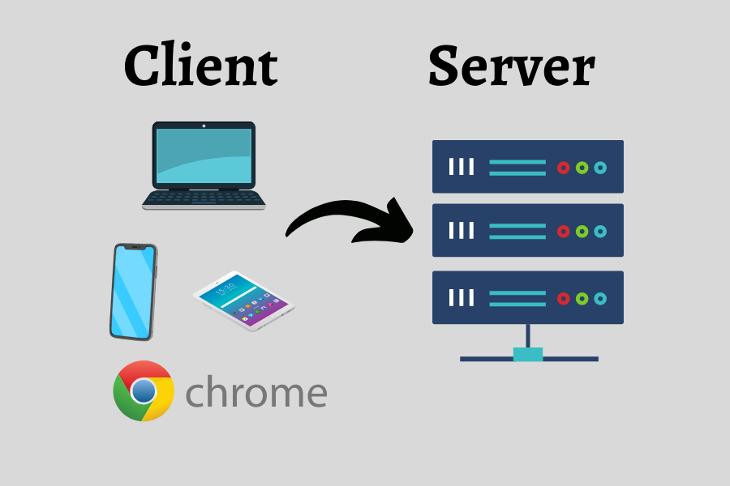

# Dev Ops Training Projects - Darey.io  

# Understanding Client Server Architecture With MySQL As RDBMS

## Introduction

In both the physical and digital realms, the concept of client-server architecture is fundamental. Just as a client seeks a service and a server provides it, in the digital world, a client, such as a computer or mobile device, interacts with a server to access information or services. This interaction forms the basis of client-server architecture.

