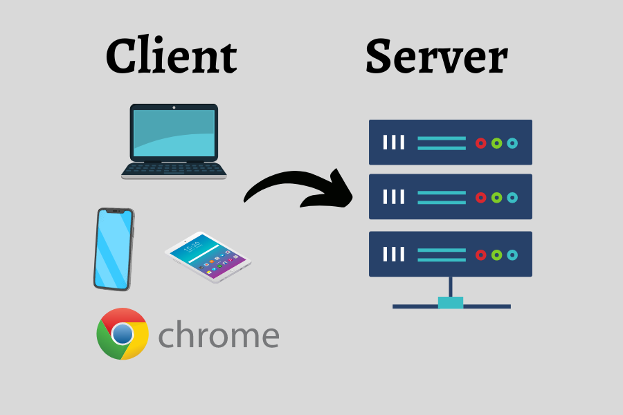
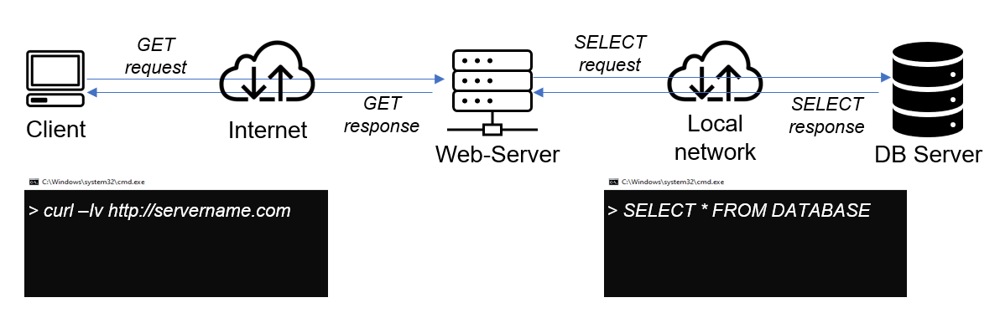

# Dev Ops Training Projects - Darey.io  

# Understanding Client Server Architecture With MySQL As RDBMS

## Introduction

In both the physical and digital realms, the concept of client-server architecture is fundamental. Just as a client seeks a service and a server provides it, in the digital world, a client, such as a computer or mobile device, interacts with a server to access information or services. This interaction forms the basis of client-server architecture.

The diagram below illustrates a basic client-server architecture.

In this architecture, clients, represented by computers or mobile devices, interact with a server to access services or retrieve information. The server, typically a remote computer, responds to client requests, facilitating the exchange of data or provision of services. This model forms the backbone of numerous digital systems, enabling seamless communication and resource sharing between clients and servers.

## Client-Server Architecture with MySQL

**MySQL**, developed by Oracle, is a relational database management system (RDBMS) that operates using structured query language (SQL). In client-server architecture with MySQL, MySQL serves both as a client and a server, facilitating data storage, retrieval, and management.

In previous projects, such as those involving LAMP and LEMP stacks, we adopted a client-server architecture where our web server acted as the client. In this setup, the web server would send requests to the database server to retrieve data and receive responses. This architecture, depicted in the image below, underscores the interaction between the web server and the database server, highlighting the flow of data retrieval in our system.

## Importance of Client-Server Architecture with MySQL

The significance of client-server systems with MySQL lies in their ability to efficiently and securely manage data for various applications. By separating user interfaces from data storage on servers, this architecture enables scalability, allowing multiple users to access the database concurrently. This structure ensures data integrity, security, and centralized storage, making it invaluable across industries like e-commerce and healthcare, where data management is critical.

## Project Prerequisites

1. **An AWS account**
2. **Proficiency in Linux and its commands**
3. **SSH keys for secure access**

## Project Highlights

* **Understanding Client Server Architecture With MySQL As RDBMS**

* **Introduction**
 - Client Server Architecture With MySQL
 - Why Is A Client Server Architecture With MySQL Important
 - Project Prerequisites

* **Implementing MySQL As A Client Server Architecture**
 - Launching EC2 Instances
 - Updating and Upgrading Package Lists
 - Installing MySQL Server Software
 - Insatlling MySQL Client Software
 - Allowing Access To MySQL Server For MySQL Client
 - Create A New User and Database On MySQL Server
 - Grant MySQL Client Administrative Prilvledges
 - Configure MySQL Server To Allow Connection From Remote Host
 - Connecting To MySQL Server From MySQL Client
 - Conclusion

## Implementing MySQL as a Client-Server Architecture

Step 1: Launching EC2 Instances

- Create two instances on AWS: "mysql server" and "mysql client."
- Access both instances via SSH.

Step 2: Updating and Upgrading Package Lists

Step 3: Installing MySQL Server Software

Step 4: Installing MySQL Client Software

Step 5: Allowing Access to MySQL Server for MySQL Client

Step 6: Creating a New User and Database on MySQL Server

Step 7: Granting MySQL Client Administrative Privileges

Step 8: Configuring MySQL Server to Allow Remote Connections

Step 9: Connecting to MySQL Server from MySQL Client

## Conclusion
In conclusion, understanding client-server architecture with MySQL is crucial for efficient data management and application development. By grasping this concept, professionals can enhance data accessibility, security, and scalability, thereby meeting the evolving demands of modern computing. This project provides practical insights into deploying and managing MySQL within a client-server environment, empowering individuals to build robust and effective systems.