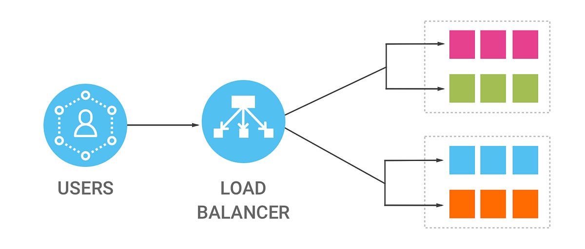

# Dev Ops Training Projects - Darey.io  

# Implementing Load Balancers With Nginx

## Introduction

In the realm of web services, efficient distribution of tasks across multiple resources is crucial for maintaining performance and reliability. Load balancing, a technique employed by tech giants like Facebook, Netflix, and Amazon, plays a pivotal role in achieving this goal. In this project, we delve into the intricacies of load balancing using Nginx, a versatile web server capable of serving as a load balancer and reverse proxy.

## Concept of Load Balancing

Load balancing involves the equitable distribution of tasks among a cluster of servers, optimizing overall efficiency and resource utilization. It ensures that no single server becomes overloaded, thereby enhancing the responsiveness and availability of web services.

## Tools Used
* Amazon EC2 Instance - Ubuntu VM
* GitHub
* Visual Studio