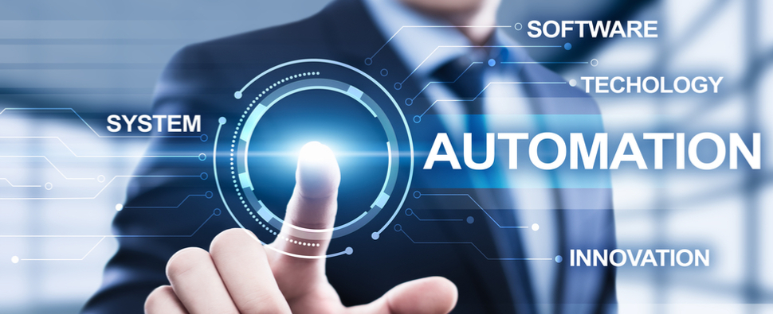

# Dev Ops Training Projects - Darey.io  

# Automating Loadbalancer Configuration With Shell scripting

## Introduction

In today's fast-paced technological landscape, automation stands as a cornerstone in the realm of DevOps engineering. Automation streamlines processes, reduces manual intervention, and enhances efficiency across various tasks. As Larry Wall aptly put it, "A good engineer is a lazy one," emphasizing the ethos of seeking ways to automate tasks to improve efficacy.

## What Is Automation?

Automation is the practice of leveraging modern technologies to eliminate manual processes. From mundane, repetitive tasks to complex decision-making processes, automation plays a pivotal role in accelerating workflows and reducing the likelihood of errors. For DevOps engineers, automation lies at the heart of their work, facilitating rapid deployment of services while minimizing operational risks.
