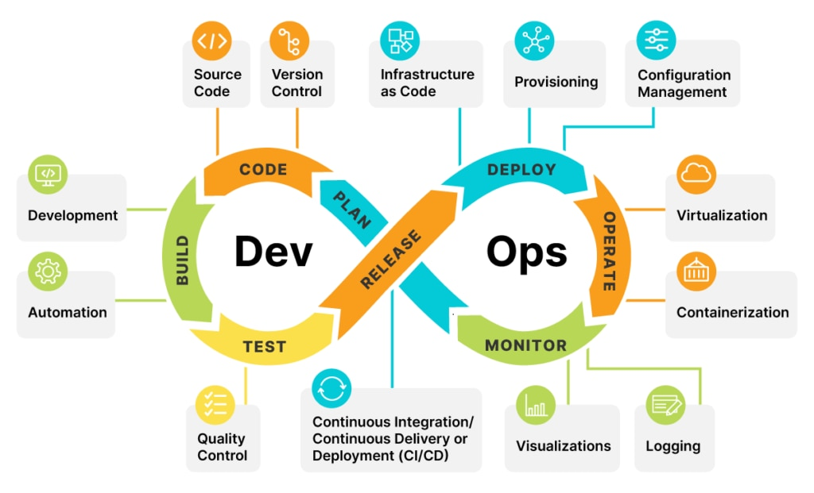

# Dev Ops Training Projects - Darey.io 
Project Based Learning - Road to DevOps

## Tools Used
* Amazon EC2 Instance - Ubuntu VM
* GitHub
* Visual Studio
* Git CLI

# Welcome To My DevOps Project

## Implementing 32 Projects in DevOps

* Project 1: Linux Practice Project
* Project 2: GIT Project